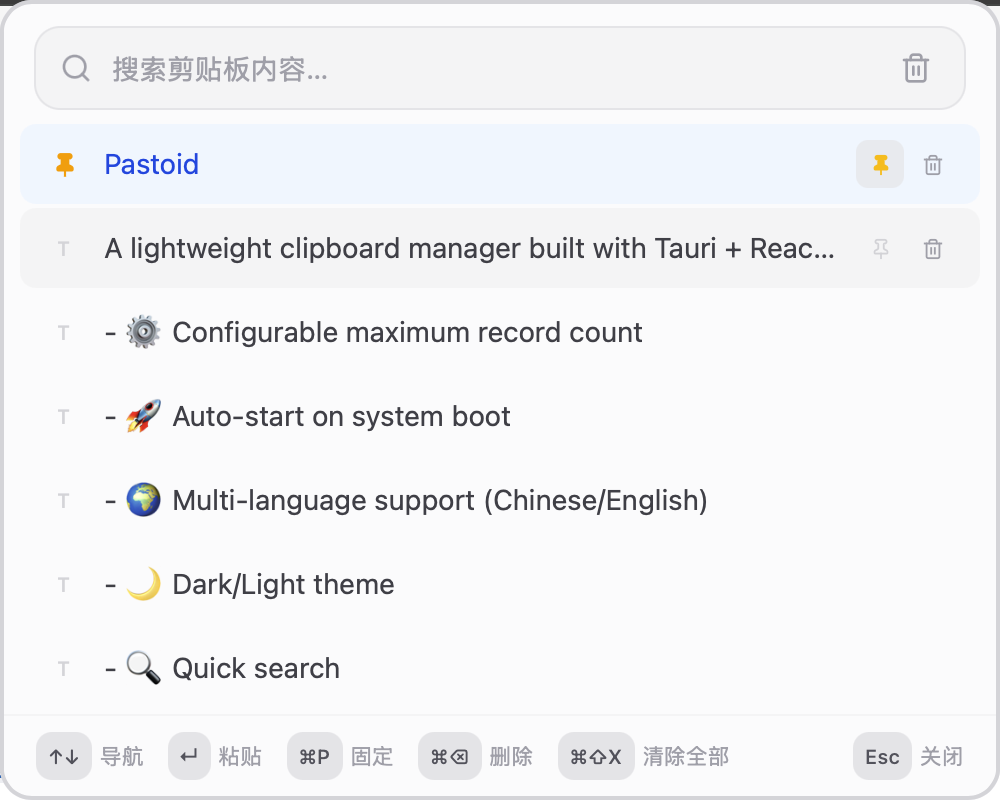
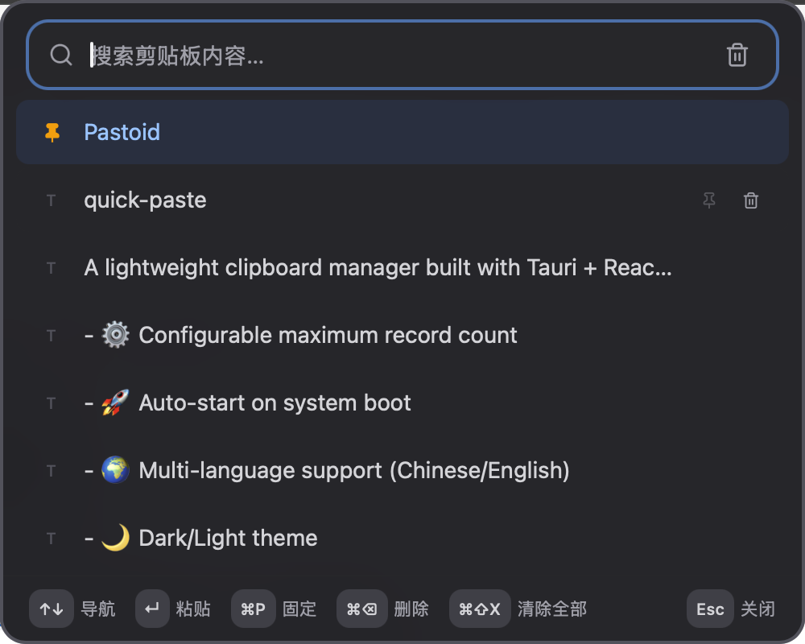

  

<h1 align="center">Pastoid</h1>

  
  

Pastoid is a lightweight, fast clipboard manager for macOS, Windows, and Linux. Built with Tauri and React, it runs quietly in the background and keeps your clipboard history always within reach.

## Why Pastoid?

Your clipboard is one of the most used tools on your computer, yet it only remembers one item at a time. Pastoid changes that by automatically saving everything you copy, so you never lose a snippet again. Whether it's a code block, a URL, a password, or a piece of text you copied hours ago — Pastoid keeps it safe and makes it easy to find.

## Key Features

- **📋 Automatic History** — Everything you copy is recorded in the background without any extra steps.
- **📌 Pin Important Items** — Keep frequently used snippets at the top of your list for instant access.
- **🔍 Instant Search** — Find any copied item in seconds with real-time search as you type.
- **🌙 Theme Support** — Choose between Light, Dark, or follow your system automatically.
- **🌍 Bilingual** — Full support for both English and Chinese interfaces.
- **🚀 Start with System** — Optional auto-start so Pastoid is always ready when you are.
- **⌨️ Keyboard-First** — Open the quick paste panel with a global shortcut, navigate with arrow keys, and paste without touching your mouse.
- **⚙️ Configurable Limits** — Set how many items to keep (1–100) to balance history depth and performance.

## Screenshots

  
    
  

## Quick Paste Panel

Press your configured shortcut (default: `Cmd+Shift+V`) anywhere to instantly summon the quick paste panel. It appears over any app — even full-screen games or videos — so you can paste without breaking your flow.

Inside the panel:
- **↑↓** to navigate
- **↵** to paste
- **⌘P** to pin or unpin
- **⌘⌫** to delete an item
- **⌘⇧X** to clear all history
- **Esc** to close

## Privacy by Design

Pastoid stores your clipboard history locally on your machine. No cloud, no account, no tracking. Your data stays yours.

## Supported Platforms

- macOS 11+ (Intel & Apple Silicon)
- Windows 10/11
- Linux (AppImage & .deb)
